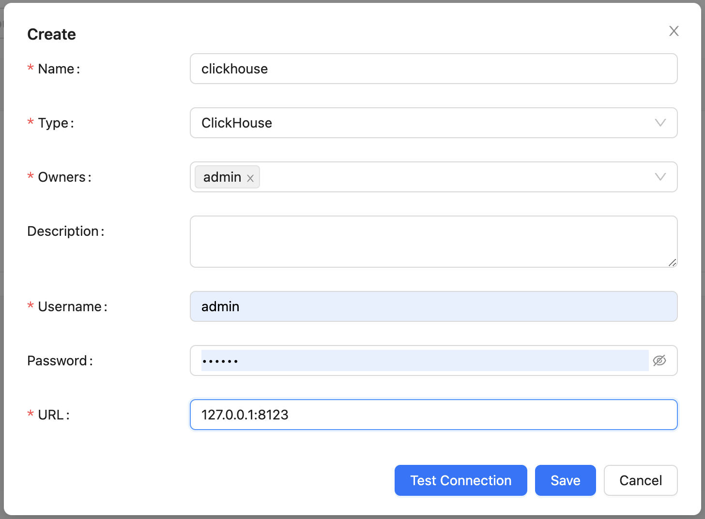

Here we use an example to introduce how to use Apache InLong creating MySQL -> Kafka -> ClickHouse data access.

## Deployment
### Install InLong

Before we begin, we need to install InLong. Here we provide two ways:
1. Install InLong with Docker by according to the [instructions here](deployment/docker.md).(Recommanded)
2. Install InLong binary according to the [instructions here](deployment/bare_metal.md).

### Install ClickHouse
```shell
docker run -d --rm --net=host --name clickhouse -e CLICKHOUSE_USER=admin -e CLICKHOUSE_PASSWORD=inlong -e CLICKHOUSE_DEFAULT_ACCESS_MANAGEMENT=1 clickhouse/clickhouse-server:22.8
```

## Cluster Initialize
When all containers are successfully started, you can access the Inlong dashboard address http://localhost, and use the following default account to log in:
```
User: admin
Password: inlong
```

### Create Cluster Tag
Click [Clusters]->[ClusterTags]->[Create] on the page to specify the cluster label name and person in charge:


:::caution
Since each component reports the ClusterTags as `default_cluster` by default, do not use other names.
:::

### Register Pulsar Cluster
Click [Clusters]->[ClusterTags]->[Create] on the page to register Pulsar Cluster:


:::note
The ClusterTags selects the newly created `default_cluster`, the Pulsar cluster deployed by docker:

Service URL is `pulsar://pulsar:6650`, Admin URL is `http://pulsar:8080`.
:::

### Register Clickhouse DataNodes
Click [DataNodes]->[Create] on the page to register ClickHouse DataNodes.


## Create Task
### Create Data Streams Group
Click [Ingestion]->[Create], inpit ID and select Pulsar Type


:::note
If you want to use Kafka, you need to modify the MQ_TYPE in docker-compose.yml
:::

### Create Data Stream
Click [Next]->[Create], config data stream


### Create Data Source
Click [Sources create]->[File], config data source informations.


### Create Data Sink
Click [Sinks create]->[ClickHouse], input Name, DbName, TableName and select created ck DataNode and so on, then click [save].


### Approve Data Stream
Click [Approval]->[MyApproval]->[Detail]->[Select Cluster tag]->[Ok]


Back to [Ingestion] page, wait for [configuration success]


## Test Data
### Enter Agent Container
```
docker exec -it agent /bin/bash
```

### Send Data
```
# collect file /data/collect-data/test.log data source configuration path and total of 10001 data packets are sent.
for i in {0..10000};do echo "name_$i | $i" >> /data/collect-data/test.log ;done
```

### Verify Data
Check data in [Audit] page


then enter ClickHouse container, check data in table


## Questions
### "specify container image platform" when start Docker Compose
The API is incompatible, you can delete platform: "linux/x86_64" in docker-compose.

### Task Configuration Failed
Generally, the MQ or Flink group configuration is incorrect. You can view the error information on the page, or enter the Manager container to view detailed logs.
