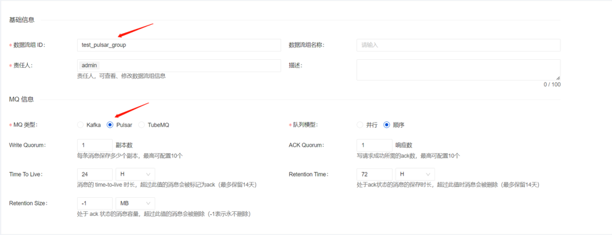
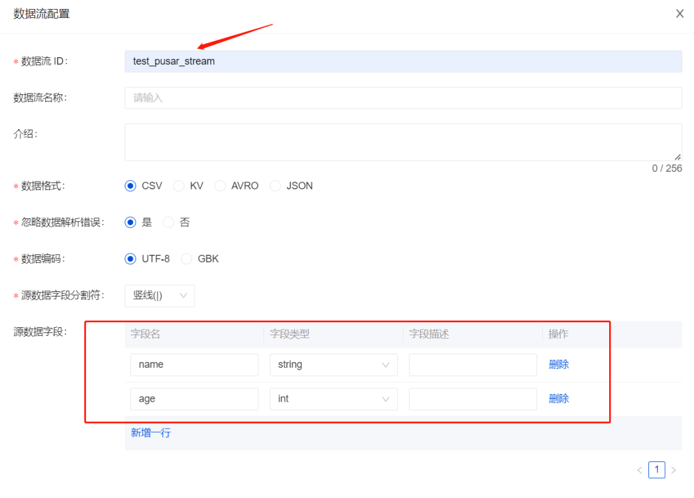
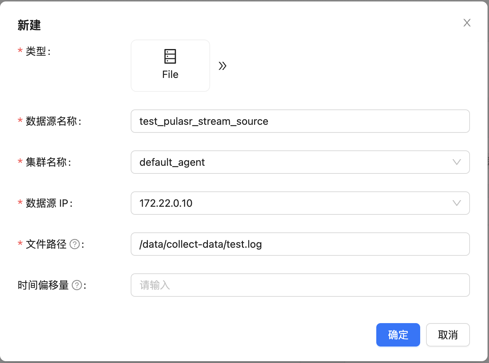
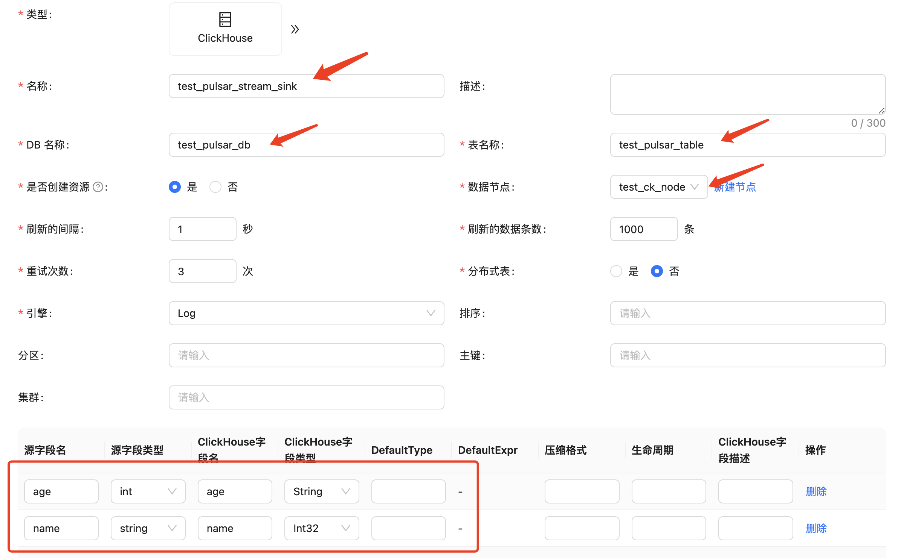
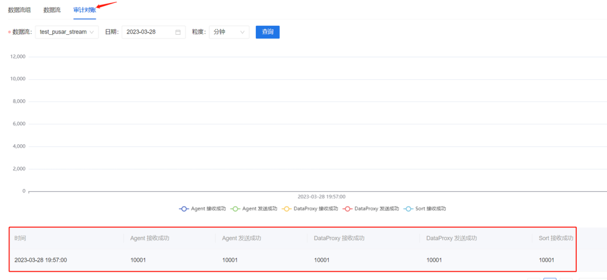

在下面的内容中，我们将通过一个完整的示例介绍如何使用 Apache InLong 创建 File -> Pulsar -> ClickHouse 数据流。

## 环境部署
### 安装 InLong
在开始之前，我们需要安装 InLong 的全部组件，这里提供两种方式：
1. 按照 [这里的说明](deployment/docker.md)，使用 Docker 进行快速部署。（推荐）
2. 按照 [这里的说明](deployment/bare_metal.md)，使用二进制包依次安装各组件。

### 安装 ClickHouse
```shell
docker run -d --rm --net=host --name clickhouse -e CLICKHOUSE_USER=admin -e CLICKHOUSE_PASSWORD=inlong -e CLICKHOUSE_DEFAULT_ACCESS_MANAGEMENT=1 clickhouse/clickhouse-server:22.8
```

## 集群初始化
容器启动成功后，访问 InLong Dashboard 地址 http://localhost，并使用以下默认账号登录：
```
User: admin
Password: inlong
```

### 创建集群标签
页面点击 【集群管理】->【标签管理】->【新建】，指定集群标签名称和负责人：


**注：default_cluster 是各个组件默认上报集群标签，请勿使用其它名称。**

### 注册 Pulsar 集群
页面点击 [集群管理]->[集群管理]->[新建集群]，注册 Pulsar 集群：


:::note
集群标签选择刚创建的 `default_cluster`，配置 Docker 部署的 Pulsar 集群：

Service URL 为 `pulsar://pulsar:6650`，Admin URL 为 `http://pulsar:8080`。
:::

### 注册 Clickhouse 数据节点
页面点击【数据节点】→【新建】，新增 ClickHouse 数据节点：


## 任务创建
### 新建数据流组
页面点击【数据接入】→【新建接入】，只用填写 ID 接选择 Pulsar 即可：


:::note
注：如果需要使用 Kafka，需要修改 docker-compose.yml 中的 MQ_TYPE。
:::

### 新建数据流
点击【下一步】→【新建数据流】，配置 ID 及测试源字段信息：


### 为数据流添加文件数据源
点击【新建数据源】，选择 File 类型，配置数据源信息，包括名称、选择采集 Agent 集群及 IP 、采集文件路径等：


### 新建数据目标
点击【新建数据目标】，选择 ClickHouse 类型，配置包括名称、库表名称、选择已创建的节点及 Schema 映射信息等，然后点击【提交审批】：


### 审批数据流
页面点击【审批管理】->【我的审批】->【详情】->【选择集群标签】->【通过】：


返回【数据集成】，等待任务配置成功：


## 测试数据
### 进入 Agent 容器
```
docker exec -it agent /bin/bash
```

### 发送数据
```
# 采集文件 /data/collect-data/test.log 数据源配置路径，总共发送 10001 条
for i in {0..10000};do echo "name_$i | $i" >> /data/collect-data/test.log ;done
```

### 数据验证
查看审计页面发送数据：


然后进入 ClickHouse 容器，查看库表数据：


## 常见问题
### Docker Compose 启动出现“specify container image platform”
API 不兼容导致，可以删除 docker-compose.yml 中的 platform: "linux/x86_64"，执行。

### 数据流配置错误
一般是 MQ 或者 Flink 集群配置错误导致，可以在页面查看错误信息，或者进入 Manager 容器查看详细日志。